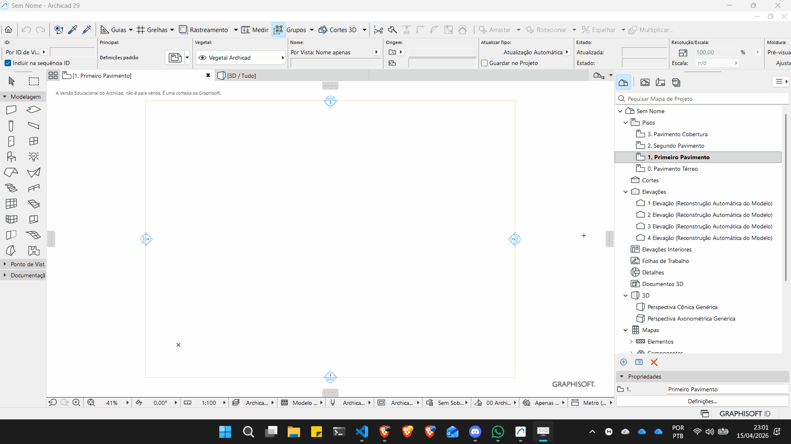
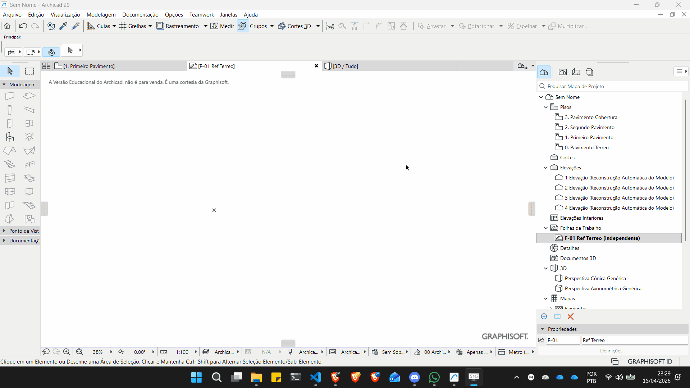
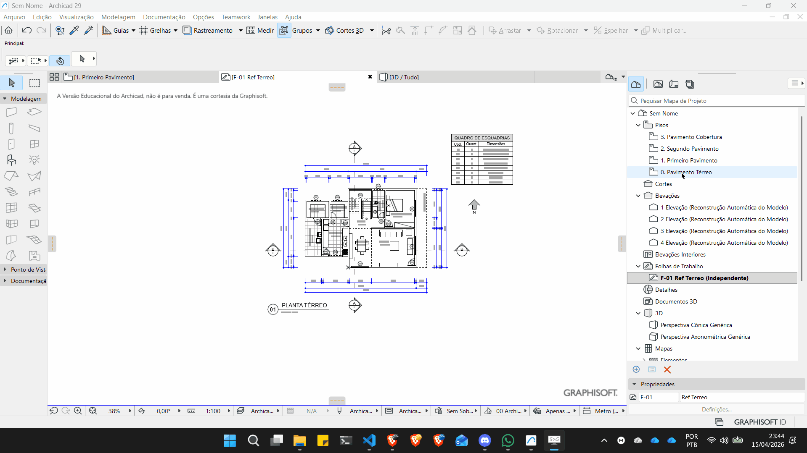

# Inserindo referências no Archicad

## Utilizando uma folha de trabalho

O primeiro passo é criar uma nova folha de trabalho. Procure o ícone das Folhas de trabalho no **Mapa de Projeto**e clique com o botão direito. escola a opção **Nova Folha de trabalho independente**.



## Inserindo o desenho

No caminho **Arquivo -> Conteúdo Externo** Clique na opção **Colocar Desenho Externo**.


Navegue até o local do arquivo e selecione-o. Posicione o desenho na **Folha de Trabalho**. Em seguida clique com o botão direito no desenho e escolha a opção **explodir dentro da vista atual**. Na caixa de diálogo desmarque a opção **Manter elementos Originais depois da explosão**. Após a explosão selecione todos os elementos da folha (abrindo o retângulo de seleção ou pelo atalho ```crtl + a```) e mova os elementos por um ponto expressivo do desenho para o ponto central da folha (marcado com um ```X```).



## Ativando a opção de rastreamento



---

## Vídeos de referência

<iframe width="560" height="315" src="https://www.youtube.com/embed/H1F0YL-XfjU?si=FBW_JFRPtgXCb4Le" title="YouTube video player" frameborder="0" allow="accelerometer; autoplay; clipboard-write; encrypted-media; gyroscope; picture-in-picture; web-share" referrerpolicy="strict-origin-when-cross-origin" allowfullscreen></iframe>

<iframe width="560" height="315" src="https://www.youtube.com/embed/gfUIDHBMHhE?si=gseWNxlOp4K5MWPM" title="YouTube video player" frameborder="0" allow="accelerometer; autoplay; clipboard-write; encrypted-media; gyroscope; picture-in-picture; web-share" referrerpolicy="strict-origin-when-cross-origin" allowfullscreen></iframe>

