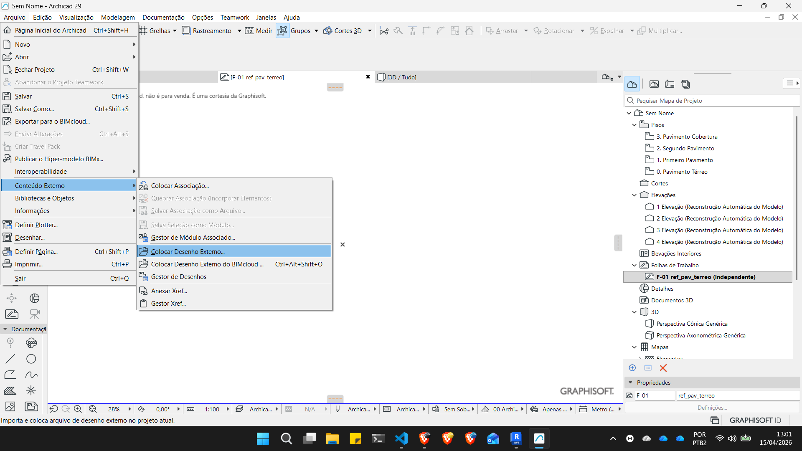
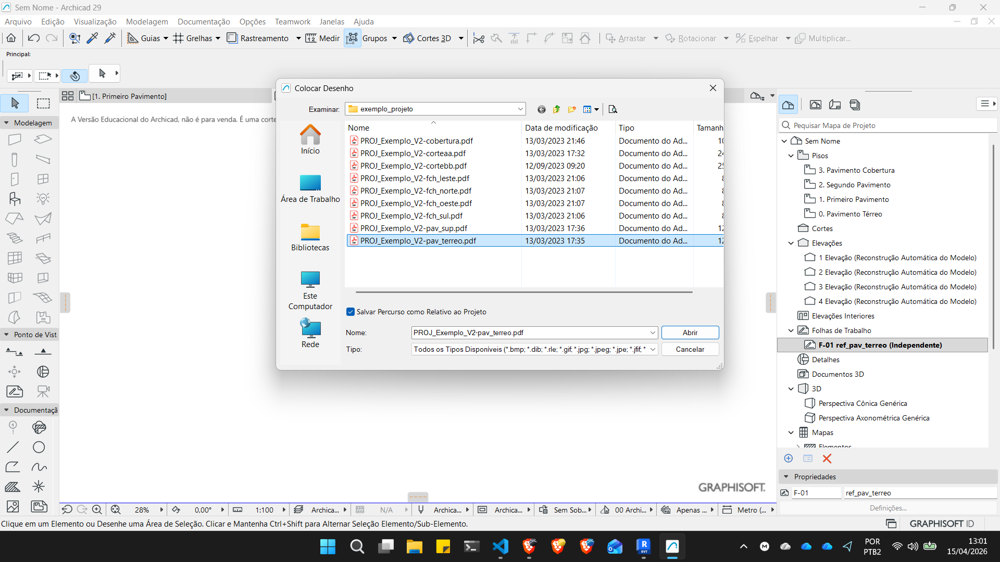
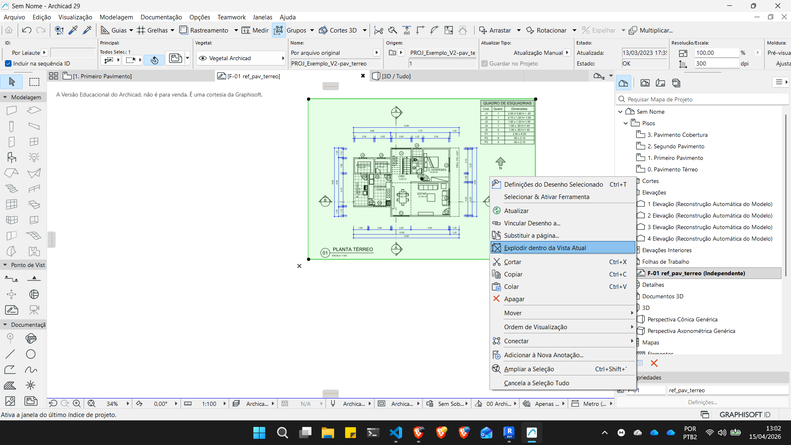
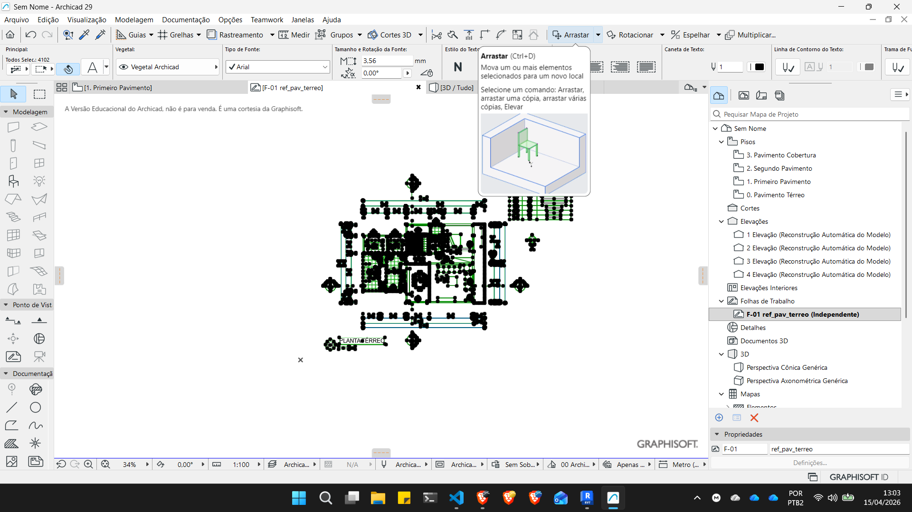

# Inserindo referências no Archicad

<iframe width="560" height="315" src="https://www.youtube.com/embed/gfUIDHBMHhE?si=gseWNxlOp4K5MWPM" title="YouTube video player" frameborder="0" allow="accelerometer; autoplay; clipboard-write; encrypted-media; gyroscope; picture-in-picture; web-share" referrerpolicy="strict-origin-when-cross-origin" allowfullscreen></iframe>

<iframe width="560" height="315" src="https://www.youtube.com/embed/H1F0YL-XfjU?si=FBW_JFRPtgXCb4Le" title="YouTube video player" frameborder="0" allow="accelerometer; autoplay; clipboard-write; encrypted-media; gyroscope; picture-in-picture; web-share" referrerpolicy="strict-origin-when-cross-origin" allowfullscreen></iframe>